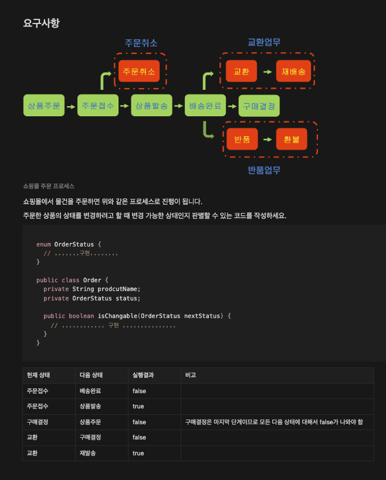

## 스탠다드 실습 

### 주제

- Enum 활용 
- Lambda 활용

###  구현 내용, 알게된 점

- Order 상태변경 체크를 위해 OrderStatus Enum값을 넘겨 name()을 통해 비교하는 식으로 구현

- Coupon, Product에서 맡고 있었던 할인 정책을 DiscountEnvent Enum으로 분리 후 할인 정책을 계산하는 함수를 작성함으로써 책임의 분리가 진행

- Order 상태변경이 잘 이루어졌는지 확인하기 위해 Junit5을 이용해 테스트 구현

### 참고한 내용

- 자바의 'enum'과 'lambda'를 클래스로 이해해보기 : https://kukim.tistory.com/68
- JUnit5 구성, 어노테이션, Assertions 정리 : https://velog.io/@ynjch97/JUnit5-JUnit5-%EA%B5%AC%EC%84%B1-%EC%96%B4%EB%85%B8%ED%85%8C%EC%9D%B4%EC%85%98-Assertions-%EC%A0%95%EB%A6%AC
